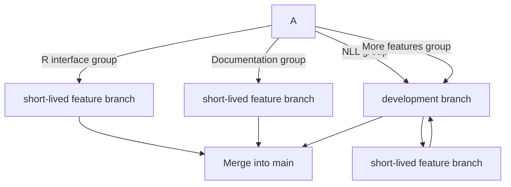

# FIMS project management process

## FIMS governance

The [FIMS Terms of Reference](https://drive.google.com/file/d/1gMDQbAhjM2E3nct4Hc6u-DT1Ta8bizLd/view?usp=sharing)
describes the high level organization of the FIMS Project. Additional
details on roles and responsibilities are provided here.

### Developers

Developers are expected to adhere to the principles and guidelines
outlined within this handbook, including the [Code of
Conduct](#code-of-conduct), [Contributer
Guidelines](#contributor-guidelines), [Style Guide](#style-guide),
[Issue Tracking](#issue-tracking), and [Testing](#testing).

### C++ developers

The C++ developer responsibilities include:

* Writing the module code.
* Creating documentation for the module and building the
[documentation](#documentation) in `doxygen` to ensure it is error-free. Run `cmake --build build` and review generated doxygen HTMLs locally 
to ensure they are error-free.
* Implementing the suite of required test cases in [Google
Test](#testing) for the module. 
Run [`cmake --build build` and `ctest --test-dir build` locally](https://noaa-fims.github.io/collaborative_workflow/testing.html#c-unit-testing-and-benchmarking) 
and make sure the C++ tests pass before pushing tests to remote feature branch. If there are failing tests, run `ctest --test-dir --rerun-failed --output-on-failure` to re-run the failed tests verbosely.
* Ensuring the run-clang-tidy and run-googletest [Github Actions workflows](#github-actions) pass on the remote feature branch

### R developers

The R developers responsibilities include:

* Writing the `Rcpp` interface to the C++ code.
* Writing Roxygen documentation for any R functions. Run `devtools::document()` 
locally and before pushing changes to the remote branch.
* Writing `testthat()` test cases for any R functionality
Run `devtools::test()` locally before pushing tests to the remote feature branch. 
* Running `styler::style_pkg()` to style R code locally and then push changes to 
remote feature branch. If there are many changes, please do this in a separate commit.
* Running `devtools::check()` locally and make sure the package can be compiled and R tests pass. If there are failing tests, run `devtools::test(filter = "file_name")` (where "test-file_name.R" is the testthat file containing failing tests) and edit code/tests to troubleshoot tests. During development, run `devtools::build()` locally to build the package more frequently and faster.
* Ensuring the code passes the call-r-cmd-check [GitHub Action workflow](#github-actions) on the remote feature branch.

### All developers

Once these are complete, the developer should create a [pull
request](#pull-requests) according to the correct template and assign
the issue tracking the completion of the bug fix and/or feature to the
assigned review team. The developer must resolve any issues arising from
the review and get confirmation from the review team before the pull
request is merged into the upstream branch.

### Reviewers

The reviewers are responsible for adhering to documented guidelines in
the [Code Review](#code-review) section. Reviewers should confirm that
the new code is able to build and run within their own development
environment as well as via the Github actions on the repository.
Reviewers should clearly document which components of the code need to
be improved to be accurate, comply with project guidelines and style, or
do not work, in the pull request thread so that the developer knows what
they need to fix.

### Regional representatives

Regional representatives are expected to communicate FIMS progress and design to their respective regions and teammates. Representatives serve as power users who provide basic training and outreach within their centers on transitioning to FIMS. These representatives are also responsible for relaying feedback, questions, and training requests that they cannot complete back to the NSAP development team and project lead. Regional representatives are expected to introduce their partner fishery management organizations to FIMS to assist transition of FIMS from research to operations.

### Project lead

The Project lead is responsible for driving decisions on FIMS features, user interfaces, and project guidelines and standards based on discussions with the OST development team and regional product representatives. The project lead ensures the FIMS product satisfies user and business requirements, incorporates feedback and iterates on the design and development as needed. The project lead will triage issues and pull requests weekly and ensure development and code review occur in a timely manner and according to project guidelines, priorities, and standards. The Project Lead is also responsible for communicating project status via maintenance of the [status dashboard](https://noaa-fims.github.io/status/). 

### Director of software development

The director of software development is responsible for designing the FIMS product architecture to maximize portability and extensibility, managing technical risks and opportunities, mentoring development and implementation team members, advising the project lead on software design and implementation decisions, managing change requests, and guaranteeing quality of deliveries via code review. The Director of Software Development also educates the team on technical best practices, creates documentation to assist in enhancing team and user understanding of the FIMS, and coordinates maintenance of the software platform.

### Lead of test development 

The lead of test development is responsible for designing and driving test objectives, test strategies and test plans of the FIMS product at subsequent milestones. The lead of test development will identify the tools for test reporting, management and automation, guide and monitor the design, implementation, and execution of test cases and test procedures.The lead of test development will train and mentor implementation team members on how to effectively write and debug tests.

### Lead of research and development

The Lead of research and development oversees the investigations into stock assessment modeling best practices that spans the scope of computer science, statistical inference, and population and community modeling. The lead of research and development provides methods and guidelines for prioritizing research needed to determine good practices and making recommendations on alternative good practice options for FIMS implementation. The lead of research and development advises the Project Lead on priority of features to be incorporated into subsequent milestones.
 
### Lead of workflows, accessibility, and integration

The lead of workflows, accessibility, and integration is responsible for designing and driving workflows and automation to support the reliability and robustness of the FIMS. The workflows, accessibility, and integration lead ensures the FIMS aligns with expected standards for accessibility and quality control in accordance with guidelines set by the [Fisheries Integrated Toolbox](https://noaa-fisheries-integrated-toolbox.github.io/). This lead coordinates with the lead test engineer to ensure test cases are automated and successfully run by Github Actions and coordinates with the lead of research and development to identify opportunities to expand FIMS across related disciplines.


### Code of conduct enforcement

The code of conduct enforcer is responsible for responding to
allegations of [code of conduct](#code-of-conduct) violations in an
appropriate manner. This could include a conversation with the violator,
his or her manager, up to and including expulsion from the FIMS
development team. If the violator is an external collaborator, they can
be banned from contributing to the FIMS Github resources in the future.

### External collaborators

External collaborators interested in contributing to FIMS development
are required to clone or fork the FIMS repository, make changes, and
submit a pull request. However, collaborators are strongly encouraged to
submit an issue via the main FIMS repository for discussion prior to
development. In general, forks are discouraged for development that is
intended for integration into FIMS as it becomes difficult to keep track
of multiple forks. If collaborators wish to use FIMS as a starting-point
for a brand new project that they do not intend to merge back into the
main branch, they can start a fork. However, if they intend to create a
pull request, they should clone the repository and use a branch.

Pull requests from forks will be reviewed the same as a pull request
submitted from a branch. Users will need to conform to the same
standards and all contributions must pass the standard tests as well as
provide tests that check the new feature.

## FIMS development cycle 

FIMS is structured as an agile software
development process with live development on the web and Github. The
development process cycles through a planning, analysis, and design
phase leading to the establishment of a developmental Milestone. The
implementation phase is made up of several development sprints that meet
the objectives of the established Milestone. This is followed by testing
& integration and a maintenance phase before the cycle starts over
again. FIMS is currently in the implementation phase of Milestone 1. See
[M1 model specification](#m1-model-specification) for a description of
the model.

```{r devcycle, echo = FALSE, out.width='75%', fig.cap="FIMS Development Cycle. Current development stage is the implementation phase of Milestone 1"} 
knitr::include_graphics("dev cycle.png")
```

### Issue lifecycle

FIMS development will adhere to a lifecycle for issues that makes it
clear which issues can be resolved when.

* Creation — The event that marks the creation of an issue. An issue is
not Active when it is Created. Issues that are opened are assigned to
the FIMS Project Lead with the label: `needs-triage`. A issue is not
considered Active until this label is removed. * Activation — When the
`needs-triage` label is removed and the issue is assigned to a
developer, the issue becomes Active. This event happens once in the
lifecycle of an issue. Activation usually is not undone but it can be
undone if an issue needs additional discussion; in this case, the
`needs-triage` label is applied again. An issue is Active from the time
it is Activated until reaches Resolution. * Response — This event only
happens if the triage team deems an issue to a wont-fix or delayed. This
requires communication with the party who opened the issue as to why
this will not be addressed or will be moved to a later milestone. *
Resolution — The event that marks the resolution of an issue. This event
happens once in the lifetime of an issue. This event can be undone if an
issue transitions from a resolved status to an unresolved status, in
which case the system considers the issue as never had been resolved. A
resolution involves a code check-in and pull request, at which point
someone must review and approve the pull request before the issue can
transition states. * In Review - The issue is "in review" after a code
solution has been proposed and is being considered via a pull request.
If this is approved, the issue can move into the "Closed" state. *
Closure—The event that marks the closure of an Issue. This even happens
once in the lifetime of an issue. The issue can enter the Closed state
from either the "In Review" or "Response" state.

```{r flowchart, echo = FALSE, out.width='75%', fig.cap="Flow chart that describes above process visually, e.g. how an issue moves from creation, to activation, to response or resolution, and is finally closed."}
knitr::include_graphics("New Flowchart.png")
```
### M2 development workflow



### Feature validation

FIMS uses a standardized set of criteria to prioritize and determine
which features will be incorporated into the next development milestone.

TODO: add criteria (to be defined) used to prioritize features for
future milestones
