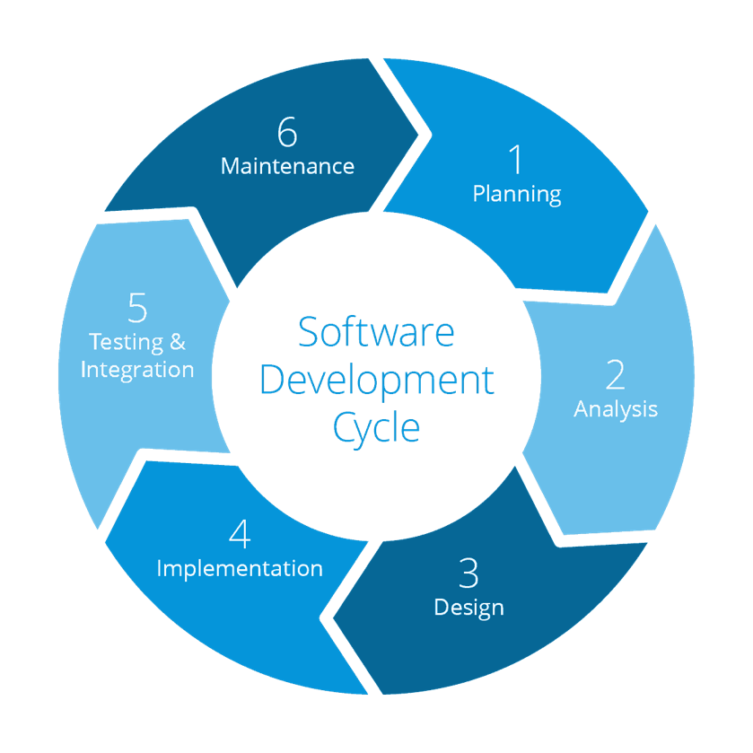
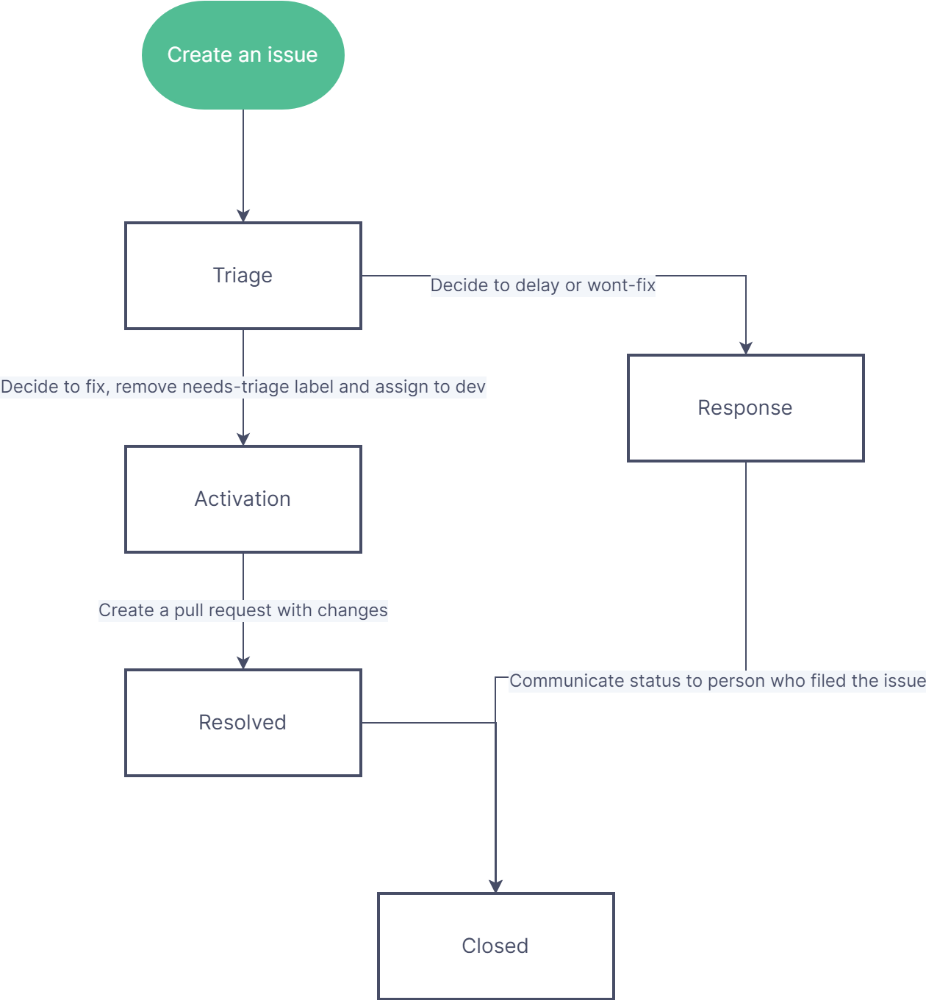

# FIMS project management process

## FIMS governance

The [FIMS Terms of Reference](https://drive.google.com/file/d/1gMDQbAhjM2E3nct4Hc6u-DT1Ta8bizLd/view?usp=sharing) describes the high level organization of the FIMS Project. Additional details on roles and responsibilities are provided here.

### Developers

Developers are expected to adhere to the principles and guidelines outlined within this handbook, including the [Code of Conduct](#code-of-conduct), [Contributer Guidelines](#contributor-guidelines), [Style Guide](#style-guide), [Issue Tracking](#issue-tracking), and [Testing](#testing).

### C++ developers

The C++ developer responsibilities include:

* Writing the module code.
* Creating documentation for the module and building the [documentation](#documentation) in `doxygen` to ensure it is error-free. Run `cmake --build build` and review generated doxygen HTMLs locally to ensure they are error-free.
* Implementing the suite of required test cases in [Google Test](#testing) for the module. Run [`cmake --build build` and `ctest --test-dir build` locally](https://noaa-fims.github.io/collaborative_workflow/testing.html#c-unit-testing-and-benchmarking) and make sure the C++ tests pass before pushing tests to remote feature branch. If there are failing tests, run `ctest --test-dir --rerun-failed --output-on-failure` to re-run the failed tests verbosely.
* Ensuring the run-clang-tidy and run-googletest [Github Actions workflows](#github-actions) pass on the remote feature branch

Below is a list of online resources for learning C++:
* [cplusplus.com](https://cplusplus.com/doc/)
* [docs.microsoft.com](https://docs.microsoft.com/en-us/cpp/standard-library)
* [geeksforgeeks.org](https://www.geeksforgeeks.org/c-plus-plus/?ref=outind)
* [learncpp.com](https://www.learncpp.com/cpp-tutorial)
* [positioniseverything.net](https://www.positioniseverything.net/category/coding/c/)
* [w3schools.com/cpp](https://www.w3schools.com/cpp)

### R developers

The R developers responsibilities include:

* Writing the `Rcpp` interface to the C++ code.
* Writing Roxygen documentation for any R functions. Run `devtools::document()` locally and before pushing changes to the remote branch.
* Writing `testthat()` test cases for any R functionality Run `devtools::test()` locally before pushing tests to the remote feature branch. 
* Running `styler::style_pkg()` to style R code locally and then push changes to remote feature branch. If there are many changes, please do this in a separate commit.
* Running `devtools::check()` locally and make sure the package can be compiled and R tests pass. If there are failing tests, run `devtools::test(filter = "file_name")` (where "test-file_name.R" is the testthat file containing failing tests) and edit code/tests to troubleshoot tests. During development, run `devtools::build()` locally to build the package more frequently and faster. * Ensuring the code passes the call-r-cmd-check [GitHub Action workflow](#github-actions) on the remote feature branch.

### All developers

Once these are complete, the developer should create a [pull request](#pull-requests) according to the correct template and assign the issue tracking the completion of the bug fix and/or feature to the assigned review team. The developer must resolve any issues arising from the review and get confirmation from the review team before the pull request is merged into the upstream branch.

### Project Lead

The Project Lead is responsible for driving decisions on FIMS features, user interfaces, and project guidelines and standards based on the vision and objectives of FIMS and discussions with the OST development team and regional product representatives. The project lead ensures the FIMS product satisfies user and business requirements, incorporates feedback, and iterates on the design and development as needed. The Project Lead will triage issues and pull requests weekly and ensure development and code review occur in a timely manner and according to project guidelines, priorities, and standards. The Project Lead is also responsible for communicating project status via maintenance of the [Github projects](https://github.com/orgs/NOAA-FIMS/projects) and scheduling tasks and managing change requests. 

### Lead Software Architect

The Lead Software Architect is responsible for advising the design of designing the FIMS product architecture to maximize portability and extensibility, managing technical risks and opportunities, mentoring development and implementation team members, advising the project lead on software design, refactor, and implementation decisions, scheduling of tasks, managing change requests, and guaranteeing quality of deliveries via code review. The Lead Software Architect also educates the team on technical best practices.

### Lead Test Engineer

The Lead Test Engineer is responsible for designing and driving test objectives, test strategies, and test plans of the FIMS product at subsequent milestones. The Lead Test Engineer will identify the tools for test reporting, management and automation, guide and monitor the design, implementation, and execution of test cases and test procedures. The Lead Test Engineer will train and mentor implementation team members on how to effectively write and debug tests.

### Lead Statistical Computing Engineer

The Lead Statistical Computing Engineer is responsible for designing the FIMS statistical architecture that maximizes statistical accuracy and ensures the implementation of statistical good practices. The Lead Statistical Computing Engineer will advise the Project Lead on design and implementation decisions and will work closely with the Lead Software Architect to ensure a balance between computation and statistical efficiency, and with the Lead Test Engineer to develop tests that check the statistical accuracy of model design. 

### Outreach and Transition Coordinator

The Outreach and Transition Coordinator communicates with policy-makers, NOAA leadership, and regional offices on transition plans from existing assessment models and processes to FIMS. This coordinator works with academic partners to develop and coordinate training on using FIMS.

### Lead of Workflows, Accessibility, and Integration

The Lead of Workflows, Accessibility, and Integration is responsible for designing and driving workflows and automation to support the reliability and robustness of the FIMS. The Lead of Workflows, Accessibility, and Integration ensures FIMS aligns with expected standards for accessibility and quality control in accordance with guidelines set by the Fisheries Integrated Toolbox. This lead coordinates with the Lead Test Engineer to ensure test cases are automated and successfully run by GitHub Actions and coordinates with the Lead Statistical Computing Engineer to identify opportunities to expand FIMS across related disciplines. 

### Regional representatives

Regional representatives are expected to assist in FIMS implementation through design, development, and testing of FIMS. They also communicate FIMS progress and design to their respective regions and teammates. Representatives serve as power users who provide basic training and outreach within their centers on transitioning to FIMS. These representatives are also responsible for relaying feedback, questions, and training requests that they cannot complete back to the NSAP development team and Project Lead. Regional representatives are expected to introduce their partner fishery management organizations to FIMS to assist transition of FIMS from research to operations.

### Code of conduct enforcement

The code of conduct enforcer is responsible for responding to allegations of [code of conduct](#code-of-conduct) violations in an appropriate manner. This could include a conversation with the violator, his or her manager, up to and including expulsion from the FIMS development team. If the violator is an external collaborator, they can be banned from contributing to the FIMS Github resources in the future.

### Collaborators

Collaborators interested in contributing to FIMS development can fork and clone any public repository within the NOAA-FIMS GitHub organization, make changes, and submit a pull request. Be sure to fork all branches and make feature branches off of your forked dev branch though. Developing off of dev branches rather than main allows for adequate testing and upkeep of downstream code. Collaborators are strongly encouraged to submit an issue to the respective repository prior to embarking on any development. In general, it is hard for developers to keep up to speed with development inside of forked repositories, and thus, ample communication will help to ensure that code can easily be merged in when the time is right.

Pull requests from forks will be reviewed under the same guidelines as pull requests from internal branches. Users will need to conform to the same standards and all contributions must pass the standard tests as well as provide passing tests that check the new feature. Broad guidelines for reviews can be found in the reviewer checklist after a pull request is submitted.

Non-GitHub contributions are also welcome. These contributions can include such things as an email noting where documentation is unclear or holding office hours to help individuals set up models. We encourage collaborators to feel welcome to contribute in any way they can, and we will do our best to incorporate these contributions into the FIMS projects. We thank you in advance for being part of the team.

## Authorship

The current development team of FIMS is listed in the [DESCRIPTION file](https://github.com/NOAA-FIMS/FIMS/blob/main/DESCRIPTION) located in the root directory of the FIMS repository. The full list of contributors to the FIMS project can be found on the [FIMS website](https://noaa-fims.github.io). When publications or presentations are developed using FIMS, the authors should feel free to list only those who contributed to that publication or presentation in whatever order they collectively see fit.

## FIMS development cycle 

FIMS is structured as an agile software development process with live development on GitHub. The development process cycles through a planning, analysis, and design phase leading to the establishment of a developmental Milestone. The implementation phase is made up of several development sprints that meet the objectives of the established Milestone. This is followed by testing & integration and a maintenance phase before the cycle starts over again. For each Milestone, we use [semantic versioning](https://semver.org/) to establish the major, minor, and patch number for the release.

```{r devcycle, echo = FALSE, out.width='75%', fig.cap="FIMS Development Cycle. Current development stage is the implementation phase of Milestone 1"} 

```

### Issue lifecycle

FIMS development will adhere to a lifecycle for issues that makes it clear which issues can be resolved when.

* Creation — The event that marks the creation of an issue. An issue is not Active when it is Created. Issues that are opened are assigned to the FIMS Project Lead with the label: `needs-triage`. A issue is not considered Active until this label is removed.
* Activation — When the `needs-triage` label is removed and the issue is assigned to a developer, the issue becomes Active. This event happens once in the lifecycle of an issue. Activation usually is not undone but it can be undone if an issue needs additional discussion; in this case, the `needs-triage` label is applied again. An issue is Active from the time it is Activated until reaches Resolution.
* Response — This event only happens if the triage team deems an issue to a wont-fix or delayed. This requires communication with the party who opened the issue as to why this will not be addressed or will be moved to a later milestone.
* Resolution — The event that marks the resolution of an issue. This event happens once in the lifetime of an issue. This event can be undone if an issue transitions from a resolved status to an unresolved status, in which case the system considers the issue as never had been resolved. A resolution involves a code check-in and pull request, at which point someone must review and approve the pull request before the issue can transition states.
* In Review - The issue is "in review" after a code solution has been proposed and is being considered via a pull request. If this is approved, the issue can move into the "Closed" state.
* Closure—The event that marks the closure of an Issue. This even happens once in the lifetime of an issue. The issue can enter the Closed state from either the "In Review" or "Response" state.

```{r flowchart, echo = FALSE, out.width='75%', fig.cap="Flow chart that describes above process visually, e.g., how an issue moves from creation, to activation, to response or resolution, and is finally closed."}

```
### M2 development workflow

```{r, echo=FALSE}
DiagrammeR::mermaid("
graph TD
    A -- R interface group --> C[short-lived feature branch];
    A -- Documentation group --> D[short-lived feature branch];
    A -- NLL group --> E[development branch];
    A -- More features group --> E[development branch];
    E --> F[short-lived feature branch];
    C --> G[Merge into main];
    D --> G;
    F --> E;
    E --> G;"
)
```

### Feature validation

FIMS uses a standardized set of criteria to prioritize and determine which features will be incorporated into the next development milestone.

TODO: add criteria (to be defined) used to prioritize features for future milestones
